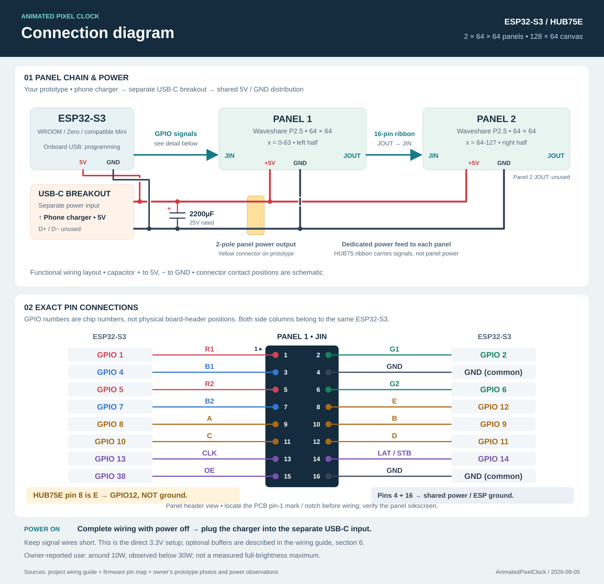

# HUB75 RGB Matrix - Wiring Guide (Phase 1 bring-up)

Step-by-step bench wiring for the AnimatedPixelClock HUB75 port: an ESP32-S3
driving **2x Waveshare P2.5 64x64 HUB75E** panels chained into a single
**128x64** RGB canvas.



[Download PNG](img/hub75_connection_diagram.png) ·
[Open scalable SVG](img/hub75_connection_diagram.svg).
The diagram shows the owner's prototype power arrangement from Section 5B:
a phone charger feeds a separate USB-C breakout, which distributes 5V/GND to
the ESP32 and both panels. Signal wiring follows Section 3.

**The pin map is compiled into the firmware, so the same wiring applies to every
supported board** - only the board's silkscreen labels and the flashing method
differ (Section 7):

| Board | Flash | Env | Powering | Verified |
|-------|:-----:|-----|----------|:--------:|
| Waveshare ESP32-S3-Zero | 4MB | `matrix-s3` | USB-C charger (whole build) | yes |
| ESP32-S3 Super Mini | 4MB | `matrix-s3` | USB-C charger (whole build) | see note* |
| ESP32-S3-WROOM-1 devkit (N16R8) | 16MB | `matrix-s3-wroom` | 5V bench PSU | yes |

*The Zero and the Super Mini flash the **same 4MB image**. The Super Mini works
with this exact wiring **only if that particular board breaks out GPIO 1-14 and
GPIO 38** and does not repurpose them - clones vary, so check its pinout before
soldering. The Zero and WROOM are hardware-verified.

> Read the whole sheet once before connecting anything. Power-on **order** and
> a common ground matter (Section 5). Keep brightness low for the first light.

---

## 1. Bill of materials

| Qty | Item | Notes |
|----:|------|-------|
| 2 | Waveshare P2.5 64x64 HUB75E panel | 1/32 scan, driver likely FM6126A (verify, Section 8) |
| 1 | ESP32-S3 board | S3-Zero (ESP32-S3FH4R2, 4MB, native USB), an S3 Super Mini (4MB), or an S3-WROOM-1 devkit (16MB, USB-UART) |
| 1 | 5V power | 10A bench PSU for the panels, **or** a single 5V USB-C charger for the whole compact build (Section 5) |
| 3 | SN74AHCT125N (quad buffer) | OPTIONAL - only if ghosting appears (Section 6) |
| - | Dupont / ribbon jumpers, 16-pin HUB75 ribbon (panel-to-panel) | |
| - | Thick 5V + GND wire for power injection | per-panel, not through the ribbon |

---

## 2. HUB75E connector pinout (16-pin, 2x8 IDC)

Looking at the panel's **JIN** (input) header. The E line is present because
this is a 64x64 / 1/32-scan panel (plain HUB75 would have GND there instead).

```
   pin  signal        pin  signal
   ---  ------        ---  ------
    1   R1             2   G1
    3   B1             4   GND
    5   R2             6   G2
    7   B2             8   E
    9   A             10   B
   11   C             12   D
   13   CLK           14   LAT (STB)
   15   OE            16   GND
```

> **Verify against the Waveshare silkscreen on arrival.** Orientation is set by
> the connector notch / the pin-1 arrow on the PCB. If labels differ, trust the
> panel silkscreen over this table.

---

## 3. ESP32-S3 -> panel1 JIN wiring

Connect each ESP32-S3 GPIO to the matching HUB75E pin on **panel 1's JIN**. The
GPIO numbers are the chip's, identical on every supported board - find them on
your board's silkscreen:

| Signal | ESP32-S3 GPIO | HUB75E pin |
|--------|:-----------:|:----------:|
| R1     | 1  | 1  |
| G1     | 2  | 2  |
| B1     | 4  | 3  |
| R2     | 5  | 5  |
| G2     | 6  | 6  |
| B2     | 7  | 7  |
| A      | 8  | 9  |
| B      | 9  | 10 |
| C      | 10 | 11 |
| D      | 11 | 12 |
| E      | 12 | 8  |
| CLK    | 13 | 13 |
| LAT    | 14 | 14 |
| OE     | 38 | 15 |
| GND    | GND | 4, 16 |

This pin map avoids the ESP32-S3 strapping pins (0/3/45/46), USB (19/20),
UART (43/44) and the PSRAM pins (33-37), so it is board-neutral. Per-board
cautions:

- **S3-Zero:** onboard WS2812 on GPIO21 (unused here) - fine.
- **WROOM-1 N16R8:** octal PSRAM occupies 33-37 (avoided) - fine.
- **Super Mini:** clones vary. Confirm GPIO 1-14 and GPIO 38 are broken out on
  the header and not used by an onboard LED before wiring.

> The HUB75 library README's S3 example uses GPIO33-37/45/21 - **those do NOT
> fit these boards.** Use the table above. The same map is hard-coded in
> `bringup/hello_matrix.cpp`; if you change wiring, change both.

---

## 4. Chaining the two panels

```
  ESP32-S3 ──16-pin──> [ Panel 1 ] JOUT ──16-pin ribbon──> JIN [ Panel 2 ]
                         x = 0..63                              x = 64..127
```

- ESP ribbon goes to **panel 1 JIN** (input).
- **Panel 1 JOUT -> panel 2 JIN** with the 16-pin ribbon.
- Data flows left-to-right: panel 1 is the left half (x 0..63), panel 2 the
  right half (x 64..127). The bring-up **seam test** (pattern 6: left red /
  right blue) confirms this ordering and a clean boundary at x=64. If the
  colors are swapped sides, the chain order is reversed.

---

## 5. Power (read the ORDER carefully)

Two ways to power the build:

**A. Bench PSU (recommended for bring-up and full brightness):**

- Inject **5V to each panel's own power terminals separately** (screw terminals
  / power pads on the panel). ~4A peak per panel; the 10A PSU covers the pair
  for a mostly-dark clock.
- **Do NOT power panel 2 through panel 1's ribbon** - the ribbon cannot carry
  panel current. Run dedicated 5V/GND wires from the PSU to each panel.
- During bring-up, power the **ESP32-S3 from USB** (for flashing + serial); the
  **panels from the PSU**.

**B. Single USB-C charger with separate power breakout (owner's prototype):**

- A phone charger feeds a **separate USB-C power breakout** on the prototype
  board. Its 5V/GND rails feed the ESP32's **5V and GND pins**, and a separate
  two-pole output connector supplies the panels. Run dedicated power wires to
  each panel; panel current does not pass through the ESP32 or HUB75 ribbon.
- The prototype photos show a **2200µF, 25V electrolytic capacitor** across the
  power rails: positive to 5V, negative to GND. The 25V marking is the capacitor
  rating; the build's supply is 5V.
- The owner reports successful phone-charger operation, estimates consumption
  around **10W**, and reports observed use staying **below 30W**. These are
  observations for their content and settings, not a full-white maximum test
  or a specified minimum charger rating.
- Complete all wiring with the charger disconnected, then plug it into the
  separate USB-C input to power the controller and panels together. The ESP32's
  onboard USB port is for programming in this arrangement.

**Power-on order for the separate-supply bench arrangement (A):**
1. **Bond all grounds FIRST** - PSU GND <-> panel 1 GND <-> panel 2 GND <->
   ESP32 GND - before any 5V is applied. One common ground point.
2. Apply panel **5V** from the PSU.
3. Plug in the ESP **USB** last.

**Ground-loop caution:** the S3 is fed from USB while the panels are fed from
the PSU, so their grounds *must* meet. Never run a panel with its ground
floating relative to the ESP. Do not hot-unplug the PSU ground while USB is
still attached.

---

## 6. Level shifting (only if needed)

Start with **direct 3.3V** from the ESP32-S3 (no buffers). With two panels and a
short ribbon this is often clean - if so, the SN74AHCT125N chips are not needed.

If you see **ghosting / flicker / dim or unstable pixels**, buffer the 12
priority lines with the 3x SN74AHCT125N (each chip = 4 buffers):

- **Buffer (12):** CLK, R1, G1, B1, R2, G2, B2, LAT, OE, A, B, C
- **Leave direct on 3.3V (2):** D, E (address lines change once per row - large
  timing margin, safe unbuffered).
- Per chip: VCC(pin 14) = 5V, GND(pin 7) = GND, tie all four `~OE` enable inputs
  LOW (to GND) so outputs are always enabled. Feed the 3.3V signal into each
  buffer's A input, take the 5V-level signal from its Y output to the panel.

(Full 14-line buffering later would need a 74AHCT245 / 74HCT541 - NOT a shift
register; 595/164 are the wrong device class.)

---

## 7. Flashing

Match the env to the board's flash size (intro table). Wrong-size env will not
fit or boot.

**Compact 4MB boards (S3-Zero, Super Mini)** - native USB, env `matrix-s3`:

1. **Hold BOOT (GPIO0)** while plugging in the USB cable -> download mode.
   (Often auto-detected; only needed if the serial port does not appear.)
2. Release BOOT.
3. `platformio run -e matrix-s3 --target upload`
4. Serial over native USB-CDC: `platformio device monitor -e matrix-s3` (115200
   baud). The sketch waits up to 2s for the USB-CDC host so the first diagnostic
   lines are not lost.

**ESP32-S3-WROOM-1 devkit (16MB)** - CH343 USB-UART, env `matrix-s3-wroom`:

1. Plug in USB; a COM / tty serial port appears (CH343 auto-reset, no BOOT hold).
2. `platformio run -e matrix-s3-wroom --target upload`
3. Serial: `platformio device monitor -e matrix-s3-wroom` (115200 baud).

After the first flash, later updates go over WiFi (OTA) from the web interface -
no cable needed, on any board.

---

## 8. FM6126A driver verification (KNOWN UNKNOWN)

The bring-up sketch defaults `USE_FM6126A 1` **only because Waveshare 64x64
units commonly need it** - it is a guess until you check.

- Look at the **IC markings on the back** of the panel.
- Empirically: if the screen stays **blank with init ON**, set `USE_FM6126A 0`
  and reflash. If blank with init OFF, set it back to `1`.
- **Record the actual chip** once known (and update project memory).

---

## 9. First-power checklist + troubleshooting

**Checklist:** grounds bonded first -> panel 5V on -> USB last -> brightness
stays low for first light -> flash -> watch the pattern cycle.

| Symptom | Likely cause / fix |
|---------|--------------------|
| Dead-black screen | FM6126A init wrong (toggle `USE_FM6126A`); OR no/!bad panel power; OR (with 2 panels) set `PANELS 1` to isolate which panel/segment is dead |
| Wrong colors (e.g. red shows blue) | R/G/B line swap - recheck R1/G1/B1, R2/G2/B2 |
| Only top OR bottom half lit/dim | R2/G2/B2 (lower-half) wiring issue |
| Image halved / doubled / mirrored vertically | Wrong scan rate - panel not 1/32, or E line not wired / wrong pin. Re-confirm scan + E pin (GPIO12 -> HUB75 pin 8) |
| Image shifted or wrapped horizontally | Address line (A-E) wiring error |
| Flicker / ghosting | Apply the AHCT125 buffer (Section 6); or toggle `mxconfig.clkphase` |
| Missing / smeared last column | Toggle `mxconfig.clkphase` |
| Right half wrong / seam colors swapped | Chain order reversed - check panel1 JOUT -> panel2 JIN |

---

*Phase 1 is done when all six bring-up patterns render correctly on the full
128x64 chain and the real driver chip is verified and recorded.*
